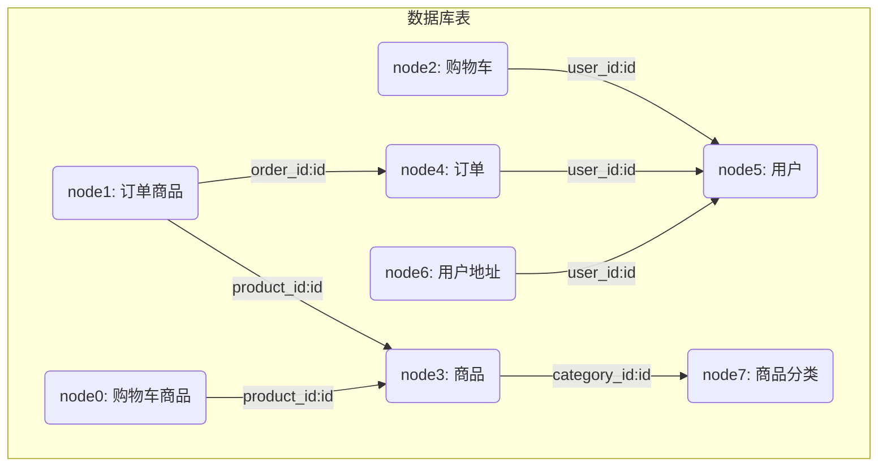

# 在线商城系统 - 使用指南

## 项目概述

这是一个基于Java21开发的控制台电商系统，使用MyBatis进行数据库操作，无Web框架，纯控制台交互。

## 技术栈

- **Java 21**: 主要开发语言
- **Maven**: 项目管理工具
- **MyBatis**: 数据库持久化框架
- **MySQL**: 数据库
- **Lombok**: 减少样板代码
- **HuTool**: 工具库（用于加密等）

## 功能特性

### 用户功能
- ✅ 用户注册和登录（密码MD5加密）
- ✅ 用户信息验证（用户名、邮箱、手机号唯一性）

### 商品功能
- ✅ 商品浏览（显示在售商品）
- ✅ 商品库存管理（待开发，需要一个管理员来更新）

### 购物车功能
- ✅ 添加商品到购物车
- ✅ 查看购物车内容
- ✅ 购物车结算
- ✅ 清空购物车
- ✅ 库存验证

### 地址管理
- ✅ 添加收货地址
- ✅ 修改地址信息
- ✅ 删除地址
- ✅ 设置默认地址

### 订单功能
- ✅ 订单生成
- ✅ 订单查看
- ✅ 自动使用默认地址

## 项目结构

```
src/main/java/com/hanserwei/
├── entity/
│   ├── dto/          # 数据传输对象
│   ├── po/           # 持久化对象
│   └── vo/           # 视图对象
├── mapper/           # MyBatis映射接口
├── service/          # 业务逻辑层
│   └── impl/         # 服务实现类
└── StoreApplication.java  # 主程序入口

src/main/resources/
├── com/hanserwei/mapper/  # MyBatis XML映射文件
├── mybatis-config.xml     # MyBatis配置
└── db.properties         # 数据库配置

sql/
├── createTable.sql       # 建表语句
└── ceateData.sql        # 模拟数据
```

## 数据库设计

使用逻辑外键实现外键约束，外键约束完全由业务层维护，减轻数据库压力，方便数据库数据备份迁移。

### 核心表结构
- **users**: 用户表
- **addresses**: 地址表
- **categories**: 商品分类表
- **products**: 商品表
- **shopping_carts**: 购物车表
- **cart_items**: 购物车商品表
- **orders**: 订单表
- **order_items**: 订单商品表

数据库表关系



## 运行方式

1. **准备数据库**
   ```sql
   -- 执行 sql/createTable.sql 创建表结构
   -- 执行 sql/ceateData.sql 插入测试数据
   ```

2. **配置数据库连接**
   ```properties
   # 修改 src/main/resources/db.properties
   jdbc.driver=com.mysql.cj.jdbc.Driver
   jdbc.url=jdbc:mysql://localhost:3306/你的数据库名
   jdbc.username=你的用户名
   jdbc.password=你的密码
   ```

3. **编译运行**

   也支持maven构建🤣。

   ```bash
   mvn clean compile
   mvn exec:java -Dexec.mainClass="com.hanserwei.StoreApplication"
   ```

## 使用流程

### 1. 启动系统
运行主程序后会看到欢迎界面和登录菜单。

### 2. 用户注册
选择"用户注册"，依次输入：
- 用户名（唯一）
- 密码
- 确认密码
- 邮箱（唯一）
- 手机号（唯一）

### 3. 用户登录
使用注册的用户名和密码登录系统。

### 4. 商品浏览
登录后选择"浏览商品"，可以：
- 查看所有在售商品
- 选择商品加入购物车

### 5. 购物车管理
选择"查看购物车"，可以：
- 查看购物车内商品和总价
- 修改购物车里的商品数量
- 进行结算（生成订单）
- 清空购物车

### 6. 地址管理
选择"管理地址"，可以：
- 添加新的收货地址
- 修改现有地址
- 删除地址
- 设置默认地址

### 7. 订单查看
选择"查看订单"，可以查看历史订单信息。

## 代码规范

### DTO设计
使用Java21的record类，简洁高效：
```java
public record UserLoginDTO(String username, String password) {}
public record UserRegisterDTO(String username, String password, String checkPassword, String email, String phoneNumber) {}
```

### 服务层设计
标准三层结构，服务接口和实现分离

清晰的接口和实现分离：
```java
public interface UserService {
    boolean userRegister(UserRegisterDTO userRegisterDTO);
    UserLoginVO userLogin(UserLoginDTO userLoginDTO);
}
```

### 数据访问层
使用MyBatis注解和XML混合配置，提供类型安全的数据访问。

## 安全特性

- 密码MD5加密存储
- 参数验证防止空值和非法输入
- 数据库约束确保数据完整性
- 用户权限验证（只能操作自己的数据）

## 错误处理

系统包含完整的异常处理机制：
- 业务异常（库存不足、用户不存在等）
- 数据验证异常
- 数据库操作异常
- 用户输入异常

## 扩展性

代码采用分层架构，易于扩展：
- 可以轻松添加新的业务功能
- 可以更换数据库实现
- 可以添加缓存层
- 可以改造为Web应用
- 可以添加日志记录但不能在控制台输出
- 可以完善单元测试
- 增加用户权限校验

## 测试数据

系统包含丰富的测试数据：
- 感谢Gemini2.5-flash提供测试数据🤣
- 4个主要商品分类
- 10+个测试商品
- 示例地址数据
- 示例订单数据

---

**注意**: 这是一个学习和演示项目，生产环境使用需要添加更多安全措施和优化。

## 参与开发
欢迎任何形式的贡献，包括但不限于：
- 提交issue
- 提交PR
    - fork本仓库
    - 创建新的分支
    - 修改代码
    - 提交PR
- 提交测试用例
- 提交文档
- 提交bug修复
- 提交新功能
- 提交代码优化建议
- 提交代码质量建议
